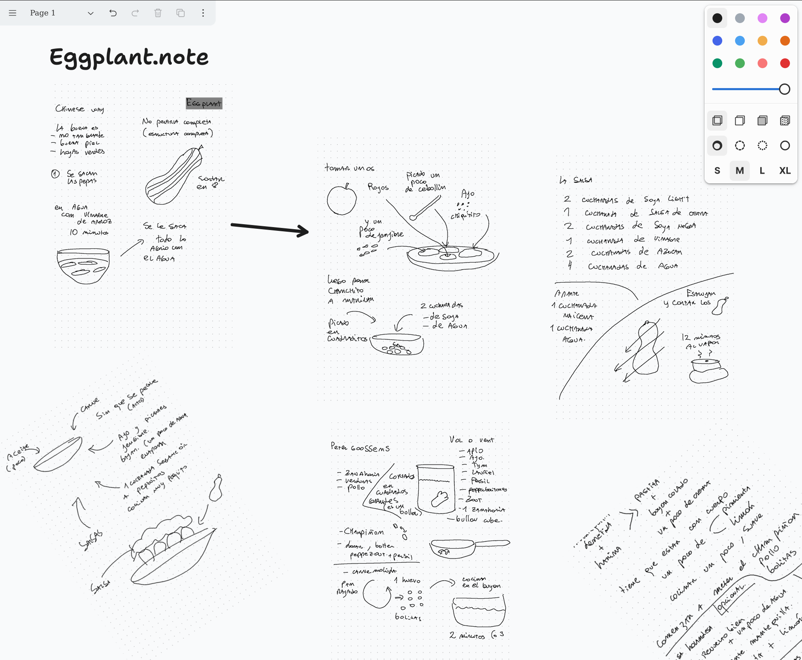

# Supernote in a canvas

Display your notes in a canvas, so you can manipulate the pages in new ways

You can try this [online](https://cristianvasquez.github.io/supernote-tldraw/
)

To use, drag and drop a .note file into the canvas

All transformations occur directly in your browser (your notes remain private and are not transmitted to any server)

The canvas functionality is provided by [tldraw](https://github.com/tldraw/tldraw) and the supernote transformation
uses [supernote-typescript](https://github.com/philips/supernote-typescript)

You can also try a simpler variant at [supernote-web-viewer/](https://cristianvasquez.github.io/supernote-web-viewer/)

